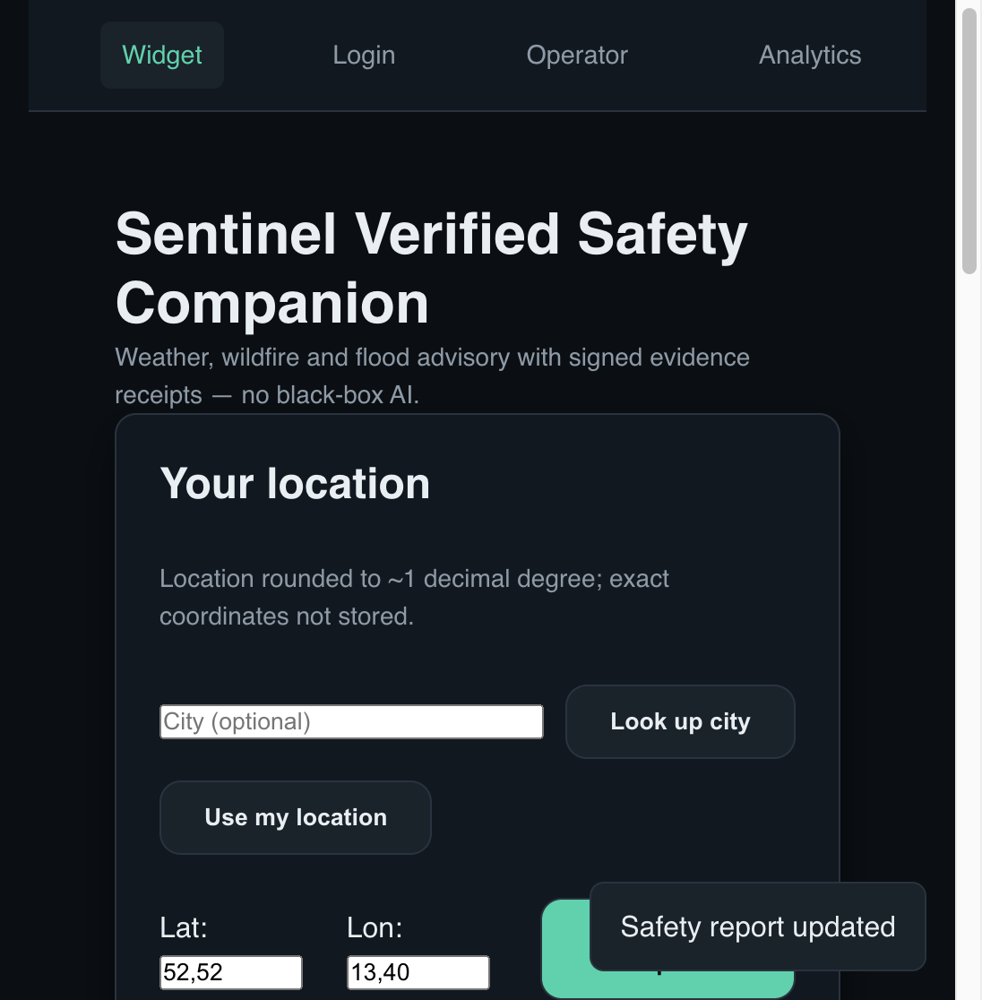

<!-- aicom-mirror-notice -->
> **🔄 Synced from a monorepo — but with a live history.** `aicom-products` mirrors the
> canonical AI-Factory monorepo. History here is append-only (no force-push).
> **Pull requests are welcome** — merged PRs are imported back into the monorepo
> and re-synced here, so your contribution becomes canonical.
> 💬 **[Issues](https://github.com/alexar76/aicom-products/issues)** · **[Pull requests](https://github.com/alexar76/aicom-products/pulls)** both welcome.

# aicom-products

<p align="center">
  
</p>

<p align="center">
  <strong>Products invented and built by <a href="https://github.com/alexar76/aicom">AI-Factory</a></strong><br/>
  Full source trees of real apps the factory conceived, coded, tested, and shipped — not templates.
</p>

<p align="center">
  <a href="PRODUCTS.md">Product index</a>
  ·
  <a href="https://github.com/alexar76/aicom">Factory monorepo</a>
  ·
  <a href="https://prod-bdb1634806de.vercel.app/">Sentinel live</a>
</p>

---

## Product map

Each folder under `products/` is one factory product id. Same table lives in [PRODUCTS.md](PRODUCTS.md) (regenerated on every catalog publish).

<!-- aicom-product-map -->
| Folder | Product | Description | Live |
| --- | --- | --- | --- |
| [`products/prod-bdb1634806de/`](products/prod-bdb1634806de/) | Sentinel | Every safety statement is proven with a signed evidence receipt. | [demo](https://prod-bdb1634806de.vercel.app) |
| [`products/prod-e1a3b0abf16a/`](products/prod-e1a3b0abf16a/) | Relay — Verified Handoff Desk | Paste an AI draft. Run a skeptic pass. Ship a Human-verified handoff to your client in under 90 seconds. | — |
<!-- /aicom-product-map -->
> **Reading this in the monorepo?** The `products/<id>/` folders linked above are
> materialised by `scripts/publish_factory_product_catalog.sh` when the catalogue is
> published, so the links resolve in the published repository and not here. The table
> itself is generated between the `aicom-product-map` markers — edit the script, not it.


---

## Gallery

### 1. Sentinel — Verified Safety Companion

Weather, wildfire and flood advisory with **signed evidence receipts** — no black-box AI. Built end-to-end by the factory (mesh invoke → ATLAS layers → live Vercel).

<p align="center">
  <a href="https://prod-bdb1634806de.vercel.app/">
    
  </a>
</p>

<p align="center">
  <a href="products/prod-bdb1634806de/"><code>products/prod-bdb1634806de</code></a>
  ·
  <strong><a href="https://prod-bdb1634806de.vercel.app/">Live demo</a></strong>
</p>

### 2. Relay — Verified Handoff Desk

Paste an AI draft, run a skeptic pass, ship a **human-verified handoff** to the client. Factory-built full stack under `products/prod-e1a3b0abf16a/`.

<p align="center">
  <a href="products/prod-e1a3b0abf16a/">
    
  </a>
</p>

<p align="center">
  <a href="products/prod-e1a3b0abf16a/"><code>products/prod-e1a3b0abf16a</code></a>
</p>

---

## What this repo is

Each subdirectory under `products/` is one factory product id (`prod-…`): **complete** application source (backend, frontend, docs) as produced by the pipeline — published on demand, never the whole monorepo dump.

```
products/<product_id>/   # full product tree (source + docs; no node_modules / .venv)
```

See the [Product map](#product-map) above or [PRODUCTS.md](PRODUCTS.md).

## Publish

**Shell** (this README / gallery / docs → GitHub), preserving existing `products/`:

```bash
GH_PAT=… ./scripts/publish_all_repos.sh --satellite aicom-products
```

**Product trees** from the factory host:

```bash
GH_PAT=… ./scripts/publish_factory_product_catalog.sh \
  --product prod-XXXXXXXXXXXX --from-factory-host
```

Auth: `GH_PAT` for **alexar76**. Remote: `https://github.com/alexar76/aicom-products.git`.
Do not freestyle remotes.

**Gitea#2** canon mirror (family host): `ssh://git@gitea2/alexar76/aicom-products.git` — same layout.
