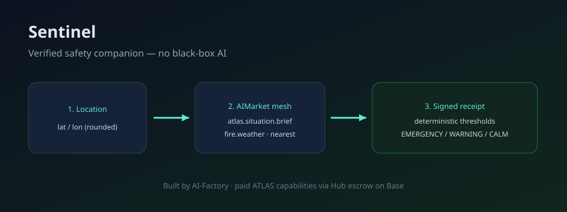

# Sentinel
> Каждое утверждение о безопасности подтверждается подписанным чеком-квитанцией.

> 🌐 [English](README.md) · [Русский](README.ru.md)

<!-- aicom-live-url -->
**Live:** [https://prod-bdb1634806de.vercel.app/](https://prod-bdb1634806de.vercel.app/)
<!-- /aicom-live-url -->

<!-- aicom-readme-badges -->
<p align="center">
  
  
  
  
</p>
<!-- /aicom-readme-badges -->

<p align="center"></p>

## Галерея
| Изображение | Подпись |
| ----------- | ------- |
| docs/gallery/01.svg | Публичный виджет с формой местоположения и карточками опасностей |
| docs/gallery/02.svg | Панель оператора с расходами и аудитом |

## Что это
Sentinel — встраиваемый компаньон безопасности без LLM, отвечающий на вопрос «безопасно ли здесь прямо сейчас?» для погодных, пожарных и наводнении опасностей. Использует возможности ATLAS sensor-mesh через протокол AI-market и детерминированные пороги.

## Что это не
Не прогноз, не мнение LLM, не оценка риска. Каждое утверждение связано с подписанным чеком-квитанцией.

## Быстрый старт
```bash
docker compose up -d --build
```
API на http://localhost:8000, frontend на http://localhost:3000.

## Тесты
```bash
cd backend && pytest tests/unit -v --cov=app --cov-report=term-missing --cov-fail-under=60
cd backend && pytest tests/integration -v
cd frontend && npm run test:unit -- --coverage
cd frontend && npm run e2e
```

## Документация
- [English](docs/en.md) · [Русский](docs/ru.md)

## Лицензия
MIT
