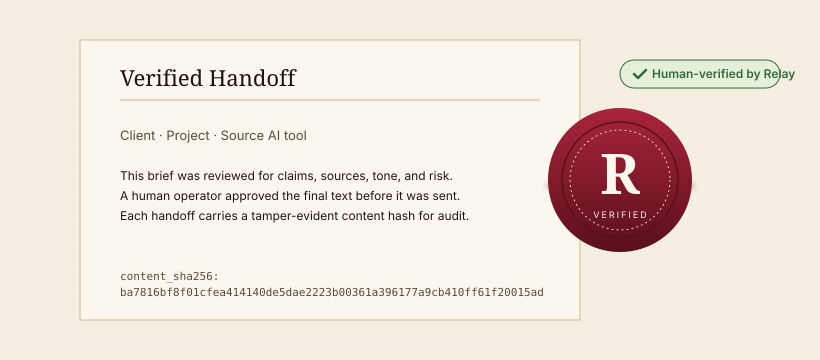

# Relay — Verified Handoff Desk

> Paste an AI draft. Run a skeptic pass. Ship a Human-verified handoff to your client in under 90 seconds.

> 🌐 [English](README.md) · [Español](README.es.md)

<!-- aicom-readme-badges -->
<p align="left">
  
  
  
  
</p>
<!-- /aicom-readme-badges -->

<p align="center"></p>

## Gallery

| Still | Caption |
| ----- | ------- |
| `docs/gallery/hero.svg` | Wax-seal hero — a notarized AI handoff, ready to send. |
| `docs/gallery/01-inbox.svg` | Operator inbox — pending, approved, rejected in three ledger columns. |
| `docs/gallery/02-share.svg` | Branded public share page — Human-verified stamp + accent strip. |
| `docs/gallery/03-embed.svg` | Embeddable verification widget — drop-in trust signal for client sites. |

## What it is

Relay is a **Verified Handoff Desk** for agencies, consultancies, and freelance professionals who ship AI-assisted deliverables to clients. An operator pastes an AI draft, runs a structured **skeptic pass** (claims, sources, tone, risk), approves or rejects in an inbox, then publishes a branded `/share/{token}` page or drops an embeddable **Human-verified** widget on a client site. Every approval carries a tamper-evident JSON receipt that compliance teams accept without follow-up.

## What it is not

- Not an AI detector. We do not score "is this AI?" — we record a human review you can prove.
- Not an enterprise GRC platform. There is no SOC 2 pipeline, no risk register, no policy library.
- Not a Notion/Docs replacement. The handoff is the artifact; the rest of your work lives where it already does.

## Quick start (local)

```bash
# 1. Clone and enter
cd relay

# 2. Configure
cp .env.example .env

# 3. Start the API and the SPA
docker compose up -d --build

# 4. Open
open http://localhost:5173          # operator console (Vite)
open http://localhost:8000/healthz  # API liveness
```

The compose stack starts the **api** (FastAPI on `:8000`), the **web** (Vite dev on `:5173`), and an optional **redis** for rate-limiting and session cache. The SQLite database is volume-mounted at `./.data/relay.db` and is auto-migrated on first boot. A demo operator is seeded so you can sign in immediately.

**Sandbox demo credentials** (also prefilled on the login form when `VITE_DEMO_EMAIL` / `VITE_DEMO_PASSWORD` are set):

```
email:    [email protected]
password: RelayDemo!2025
```

## Tests

Run the test pyramid in order:

```bash
# 1. Component / unit tests on the backend (with coverage)
cd backend && pytest tests/unit -q --cov=app --cov-fail-under=60

# 2. Functional / integration tests (HTTP + SQLite, no browser)
cd backend && pytest tests/integration -q

# 3. UI end-to-end tests (Playwright)
cd frontend && npx playwright test
```

## Docs

- [English](docs/en.md) · [Español](docs/es.md)
- [OpenAPI 3.1 schema](docs/openapi.json)
- [JSON receipt schema](docs/receipts.schema.json)
- [CHANGELOG](CHANGELOG.md) · [SECURITY](SECURITY.md) · [CONTRIBUTING](CONTRIBUTING.md)

## License

[MIT](LICENSE) — see `LICENSE` for the full text.
